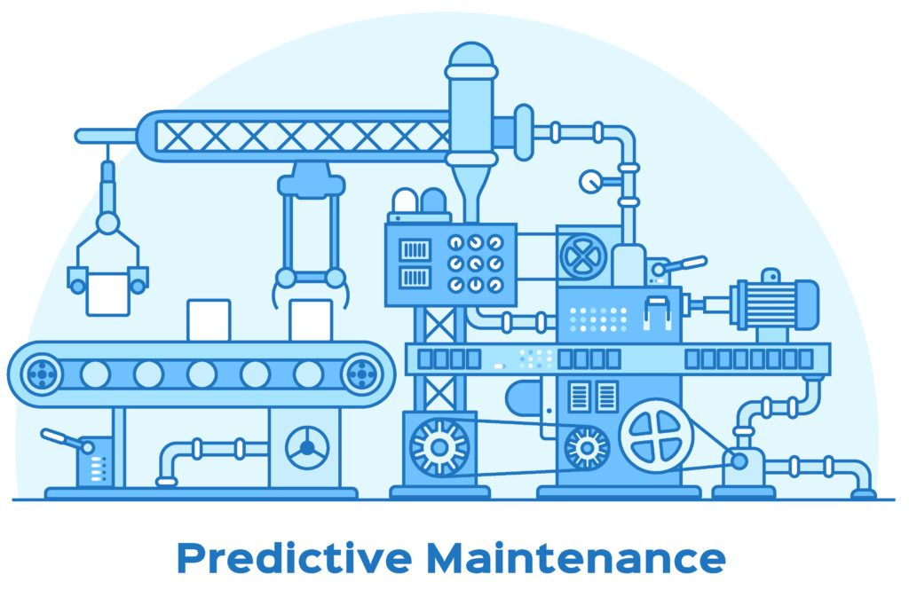

Predictive Maintainence for Manufacturing Equipment
==============================

A short description of the project.

Project Organization
------------

    ├──Pictures             <- Contains app pictures   
    ├── artifacts          <- file generated and captured from an experiment's run or job
    ├── README.md          <- The top-level README for developers using this project.
    ├── data                    <- Data from third party sources.
    
    ├── Pipelines               <- folder contains processing and modeling steps designed to automate, standardize and streamline the process of building, training, evaluating and deploying machine learning models
    │
    ├── steps             <- folder contains a single piece or stage of a ZenML pipeline
    │
    ├── test          <- Jupyter notebooks. 
  
    ├── requirements.txt   <- The requirements file for reproducing the analysis environment, e.g.
    │                         generated with `pip freeze > requirements.txt`
    │
    ├── app.py           <- streamlit app code

--------

 

# project-Dashboard:
  https://project-6-6dte.onrender.com
# Overview
   The goal is to develop a predictive maintenance model that can predict equipment failures before they occur. The dataset includes sensor readings and maintenance logs from a variety of machines.

# Features
- Data Collection: Gathered Airbnb data from various sources, including MongoDB.
- Data Preprocessing: Cleaned and prepared the data for analysis. 
- ETL (Extract, Transform, Load): Converted data from MongoDB to structured DataFrames.
- Exploratory Data Analysis (EDA): Performed in-depth analysis and visualization of Airbnb data.
- Interactive Streamlit UI: Developed a user-friendly interface for data exploration and presentation.

# Getting Started

1. Clone the repository:
   
         https://github.com/Kobalan/project-6.git

2. Install required packages:
   
        pip install -r requirements.txt

3. Run the Streamlit app:

       streamlit run app.py

# Methods
- Data Collection: Web scraping, API access, database queries.
- Data Preprocessing: Data cleaning, handling missing values, feature engineering.
- ETL Work: MongoDB data extraction, data transformation using Pandas.
- EDA: Visualization with Matplotlib, Seaborn, and Plotly.
- Model Creation: Create a classification model that predicts whether equipment is failure or not failure
- Streamlit UI: Streamlit library for building interactive web applications.

# Skills Covered
- Data collection and integration.
- Data cleaning and preprocessing.
- ETL techniques for data transformation.
- Exploratory Data Analysis (EDA).
- Data visualization.
- Machine Learning
- Web application development with Streamlit.
- Deployment

# Results
- The project provides a user-friendly interface for predicting the equipment is going to failure or not.

**Contact**

📧 Email: kobalanm2705@gmail.com 
🌐 LinkedIn: [linkedin.com/in/kobalan-m](https://www.linkedin.com/in/kobalan-m-106267227/)

